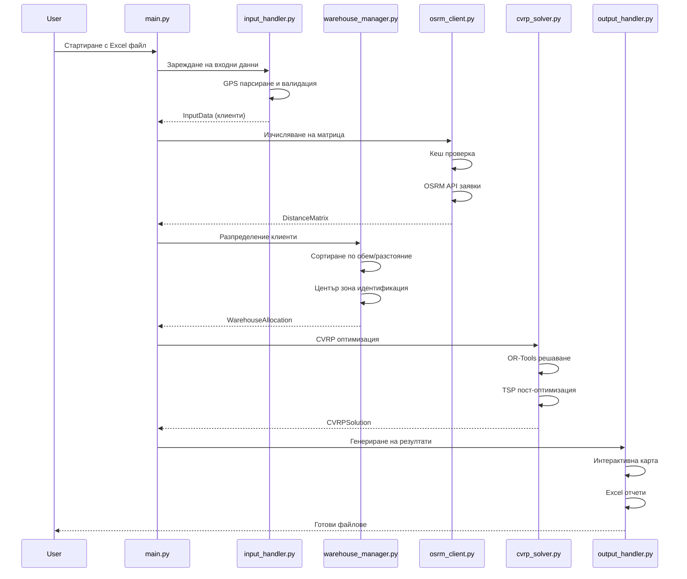
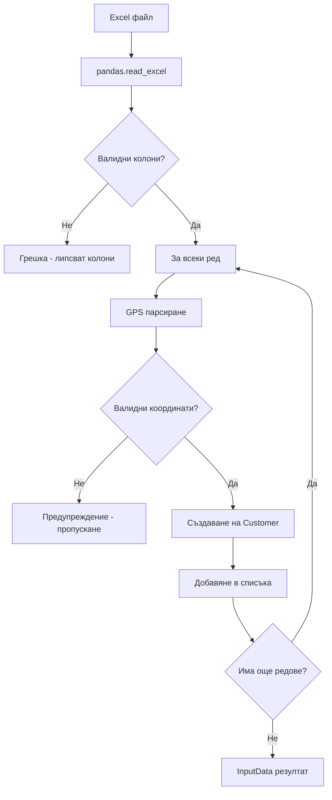
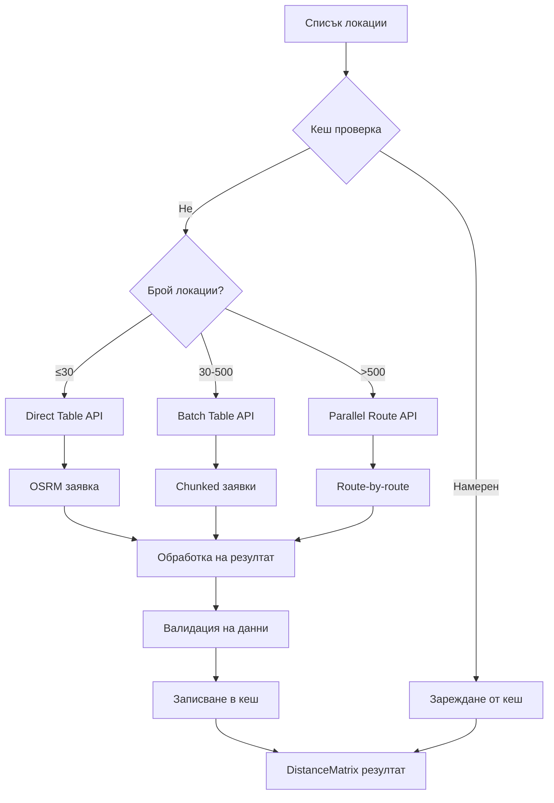
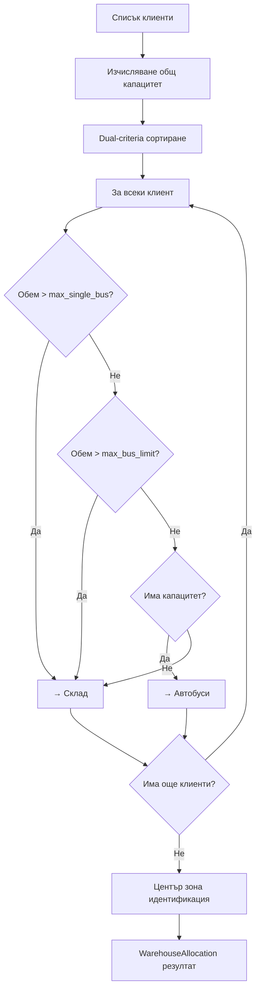
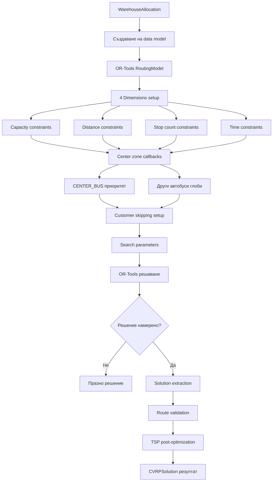
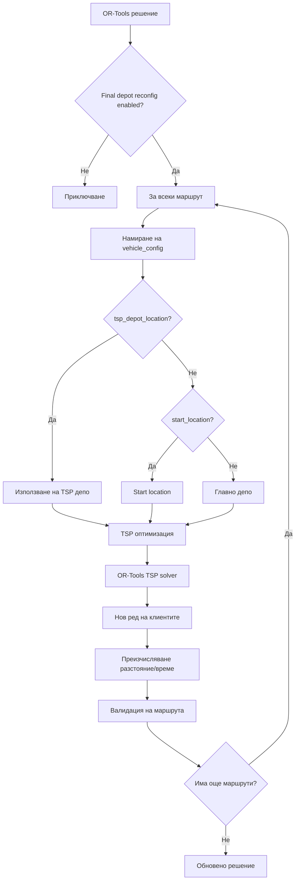
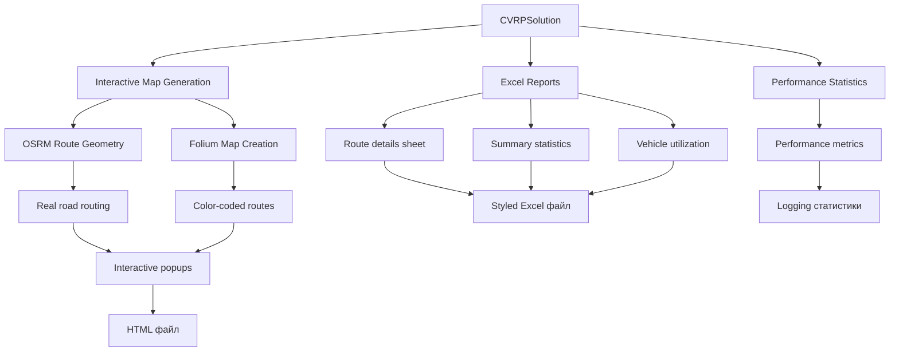
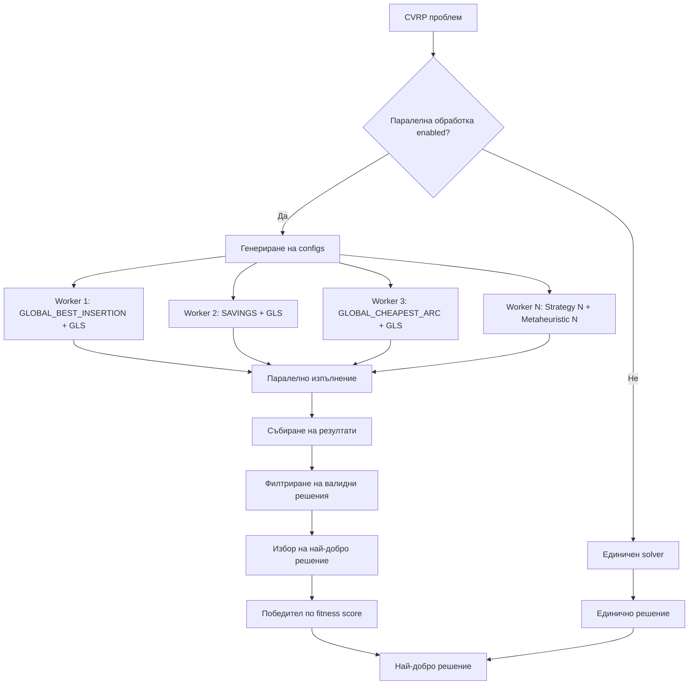
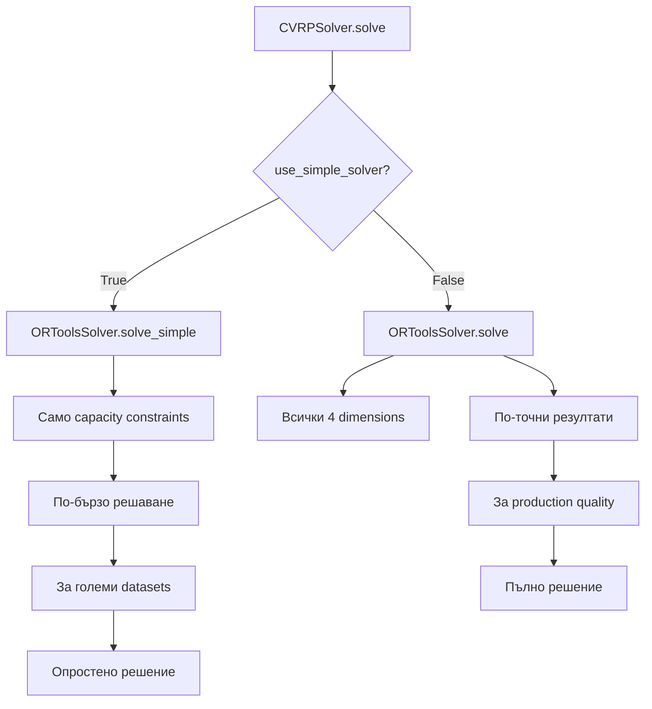

# 🔄 CVRP Optimizer - Работни процеси и алгоритми

## 📋 Съдържание

- [🏃‍♂️ Общ работен процес](#️-общ-работен-процес)
- [📥 Стъпка 1: Подготовка на данни](#-стъпка-1-подготовка-на-данни)
- [🗺️ Стъпка 1.5: OSRM матрица](#️-стъпка-15-osrm-матрица)
- [🏭 Стъпка 2: Складова логика](#-стъпка-2-складова-логика)
- [🧠 Стъпка 3: CVRP решаване](#-стъпка-3-cvrp-решаване)
- [🎯 Стъпка 4: TSP оптимизация](#-стъпка-4-tsp-оптимизация)
- [📊 Стъпка 5: Генериране на резултати](#-стъпка-5-генериране-на-резултати)
- [⚡ Паралелна обработка](#-паралелна-обработка)
- [🎛️ Конфигурационни режими](#️-конфигурационни-режими)

---

## 🏃‍♂️ Общ работен процес



---

## 📥 Стъпка 1: Подготовка на данни

### input_handler.py - Процес на зареждане

```python
def load_data(self, file_path: Optional[str]) -> InputData:
    """
    1. Търсене на входния файл
    2. Excel четене с pandas
    3. GPS парсиране за всеки клиент
    4. Data validation и почистване
    5. Създаване на Customer обекти
    """
```

**Детайлен процес:**



**GPS парсиране алгоритъм:**

```python
def parse_gps_string(gps_string: str) -> Optional[Tuple[float, float]]:
    """
    Поддържани формати:
    - "42.123456, 23.567890"    # Стандартен формат с запетая
    - "42.123456,23.567890"     # Без интервал
    - "42.123456 23.567890"     # Space-separated
    - "N42.123456 E23.567890"   # Hemisphere notation
    
    Валидация:
    - Latitude: -90 ≤ lat ≤ 90
    - Longitude: -180 ≤ lon ≤ 180
    """
    
    # Regex pattern за decimal coordinates
    decimal_pattern = r'(-?\d+\.?\d*),?\s*(-?\d+\.?\d*)'
    match = re.search(decimal_pattern, gps_string)
    
    if match:
        lat, lon = float(match.group(1)), float(match.group(2))
        if -90 <= lat <= 90 and -180 <= lon <= 180:
            return (lat, lon)
    
    return None  # Invalid coordinates
```

---

## 🗺️ Стъпка 1.5: OSRM матрица

### osrm_client.py - Интелигентна матрица



**Intelligent chunking алгоритъм:**

```python
def _build_optimized_table_batches(self, locations):
    """
    Квадратично chunking за Table API:
    
    1. Определяване на оптимален chunk_size (80 locations)
    2. Създаване на подматрици sources×destinations
    3. Паралелно изпълнение на batch заявки
    4. Merge на резултатите в пълна матрица
    """
    
    chunk_size = min(80, len(locations))
    
    # Квадратични chunks за Table API
    chunks = []
    for i in range(0, len(locations), chunk_size):
        for j in range(0, len(locations), chunk_size):
            source_chunk = list(range(i, min(i + chunk_size, len(locations))))
            dest_chunk = list(range(j, min(j + chunk_size, len(locations))))
            chunks.append((source_chunk, dest_chunk))
    
    # Паралелно изпълнение
    with ThreadPoolExecutor(max_workers=5) as executor:
        results = list(executor.map(self._fetch_table_chunk, chunks))
    
    # Merge в пълна матрица
    return self._merge_chunks(results, len(locations))
```

**Fallback hierarchy:**

```python
def get_distance_matrix_with_fallback(self, locations):
    """
    Multi-tier fallback система:
    
    Tier 1: Local OSRM (localhost:5000)
    Tier 2: Public OSRM (router.project-osrm.org)  
    Tier 3: Haversine approximation
    Tier 4: Euclidean distance (worst case)
    """
    
    try:
        return self._local_osrm_request(locations)
    except OSRMLocalError:
        try:
            return self._public_osrm_request(locations)
        except OSRMPublicError:
            logger.warning("OSRM недостъпен, използвам Haversine approximation")
            return self._haversine_matrix(locations)
```

---

## 🏭 Стъпка 2: Складова логика

### warehouse_manager.py - Интелигентно разпределение



**Dual-criteria sorting алгоритъм:**

```python
def _sort_customers(self, customers: List[Customer]) -> List[Customer]:
    """
    Двумерно сортиране:
    
    1. Primary key: Обем (ascending) - от малък към голям
    2. Secondary key: Разстояние (descending) - от далечен към близо
    
    Логика: Малките клиенти първо, далечните с приоритет
    """
    
    depot_location = self.location_config.depot_location
    
    return sorted(customers, key=lambda c: (
        c.volume,  # Малки клиенти първо
        -calculate_distance_km(c.coordinates, depot_location)  # Далечни първо
    ))
```

**Center zone identification:**

```python
def _identify_center_zone_customers(self, customers):
    """
    GPS-базирано разпознаване на център зоната:
    
    1. За всеки клиент изчисляваме разстоянието до центъра
    2. Ако разстояние ≤ center_zone_radius_km → център зона
    3. Клиентите в центъра се маркират за специална обработка
    """
    
    center_location = self.location_config.center_location
    radius_km = self.location_config.center_zone_radius_km
    
    center_zone_customers = []
    for customer in customers:
        distance = calculate_distance_km(customer.coordinates, center_location)
        if distance <= radius_km:
            center_zone_customers.append(customer)
    
    return center_zone_customers
```

**Allocation optimization:**

```python
def _allocate_with_warehouse(self, sorted_customers, total_capacity):
    """
    Три нива на филтриране:
    
    1. Size filter: > max_single_bus_capacity → warehouse
    2. Policy filter: > max_bus_customer_volume → warehouse
    3. Capacity filter: Пълнене до 100% capacity
    """
    
    vehicle_customers = []
    warehouse_customers = []
    current_volume = 0.0
    
    max_single_bus = self._get_max_single_bus_capacity()
    max_policy_volume = self.config.max_bus_customer_volume
    
    for customer in sorted_customers:
        # Level 1: Physical constraint
        if customer.volume > max_single_bus:
            warehouse_customers.append(customer)
            continue
            
        # Level 2: Policy constraint  
        if customer.volume > max_policy_volume:
            warehouse_customers.append(customer)
            continue
            
        # Level 3: Capacity constraint
        if current_volume + customer.volume <= total_capacity:
            vehicle_customers.append(customer)
            current_volume += customer.volume
        else:
            warehouse_customers.append(customer)
    
    return WarehouseAllocation(
        vehicle_customers=vehicle_customers,
        warehouse_customers=warehouse_customers,
        capacity_utilization=current_volume / total_capacity
    )
```

---

## 🧠 Стъпка 3: CVRP решаване

### cvrp_solver.py - OR-Tools оптимизация



**Four dimensions setup:**

```python
def setup_constraints(self, routing, manager, data):
    """
    Четири активни dimensions:
    
    1. Capacity: Vehicle-specific капацитети
    2. Distance: Максимални разстояния  
    3. Stops: Максимален брой клиенти
    4. Time: Работно време + service times
    """
    
    # 1. Capacity dimension
    routing.AddDimensionWithVehicleCapacity(
        demand_callback_index, 0, data['vehicle_capacities'], True, "Capacity"
    )
    
    # 2. Distance dimension  
    routing.AddDimensionWithVehicleCapacity(
        transit_callback_index, 0, data['vehicle_max_distances'], True, "Distance"
    )
    
    # 3. Stops dimension
    routing.AddDimensionWithVehicleCapacity(
        stop_callback_index, 0, data['vehicle_max_stops'], True, "Stops"
    )
    
    # 4. Time dimension (vehicle-specific service times)
    routing.AddDimensionWithVehicleCapacity(
        time_callback_index, 0, data['vehicle_max_times'], False, "Time"
    )
```

**Center zone priority system:**

```python
def apply_center_zone_logic(self, routing, manager):
    """
    Multi-callback система:
    
    1. BASE callback: Реални разстояния за всички
    2. CENTER_BUS callback: 90% отстъпка в център зоната
    3. OTHER_BUS callbacks: 40,000 единици глоба за център зона
    """
    
    # CENTER_BUS приоритет
    def center_bus_priority_callback(from_index, to_index):
        if is_center_zone_customer(to_index):
            return int(base_distance * self.config.discount_center_bus)  # 90% отстъпка
        return base_distance
    
    # EXTERNAL_BUS глоба
    def external_bus_penalty_callback(from_index, to_index):
        if is_center_zone_customer(to_index):
            return int(base_distance + self.config.external_bus_center_penalty)  # +40,000
        return base_distance
    
    # Прилагане на callbacks към съответните vehicles
    for vehicle_id in data['center_bus_vehicle_ids']:
        routing.SetArcCostEvaluatorOfVehicle(center_bus_callback_index, vehicle_id)
        
    for vehicle_id in data['external_bus_vehicle_ids']:
        routing.SetArcCostEvaluatorOfVehicle(external_bus_callback_index, vehicle_id)
```

**Customer skipping logic:**

```python
def setup_customer_skipping(self, routing, manager, data):
    """
    Disjunction system за optional customers:
    
    1. Всеки клиент може да бъде пропуснат
    2. Penalty = distance_penalty_disjunction (45,000)
    3. Solver минимизира общата цена (distance + penalties)
    """
    
    if self.config.allow_customer_skipping:
        penalty = min(self.config.distance_penalty_disjunction, 9223372036854775807)
        
        for node_idx in range(len(unique_depots), len(data['distance_matrix'])):
            routing.AddDisjunction([manager.NodeToIndex(node_idx)], penalty)
```

---

## 🎯 Стъпка 4: TSP оптимизация

### Post-optimization с персонализирани депа



**TSP solver implementation:**

```python
def _optimize_route_from_depot(self, customers, depot_location, vehicle_config):
    """
    OR-Tools TSP решател за single route optimization:
    
    1. Създаване на TSP проблем (1 vehicle, no constraints)
    2. Euclidean distance matrix за бързина
    3. AUTOMATIC strategy за оптимална скорост/качество
    4. Extraction на optimal customer sequence
    """
    
    # TSP problem setup
    locations = [depot_location] + [c.coordinates for c in customers]
    distance_matrix = self._create_euclidean_matrix(locations)
    
    manager = pywrapcp.RoutingIndexManager(len(locations), 1, 0)  # 1 vehicle, depot at 0
    routing = pywrapcp.RoutingModel(manager)
    
    # Distance callback
    def distance_callback(from_index, to_index):
        return distance_matrix[manager.IndexToNode(from_index)][manager.IndexToNode(to_index)]
    
    routing.SetArcCostEvaluatorOfAllVehicles(
        routing.RegisterTransitCallback(distance_callback)
    )
    
    # Fast search parameters
    search_parameters = pywrapcp.DefaultRoutingSearchParameters()
    search_parameters.first_solution_strategy = routing_enums_pb2.FirstSolutionStrategy.AUTOMATIC
    search_parameters.local_search_metaheuristic = routing_enums_pb2.LocalSearchMetaheuristic.AUTOMATIC
    search_parameters.time_limit.seconds = 10  # Quick TSP solve
    
    # Solve TSP
    solution = routing.SolveWithParameters(search_parameters)
    
    if solution:
        return self._extract_tsp_sequence(manager, routing, solution, customers)
    else:
        return self._greedy_fallback(customers, depot_location)
```

**Greedy fallback algorithm:**

```python
def _optimize_route_greedy(self, customers, depot_location):
    """
    Greedy nearest-neighbor като fallback:
    
    1. Започваме от депото
    2. На всяка стъпка избираме най-близкия неопосетен клиент
    3. Продължаваме докато всички клиенти са посетени
    """
    
    optimized_customers = []
    remaining_customers = customers.copy()
    current_location = depot_location
    
    while remaining_customers:
        # Намираме най-близкия клиент
        closest_customer = min(remaining_customers, 
                             key=lambda c: calculate_distance_km(current_location, c.coordinates))
        
        optimized_customers.append(closest_customer)
        remaining_customers.remove(closest_customer)
        current_location = closest_customer.coordinates
    
    return optimized_customers
```

**Accurate time calculation:**

```python
def _calculate_accurate_route_time(self, customers, depot_location, vehicle_config):
    """
    Precise time calculation с vehicle-specific service times:
    
    1. Travel time от OSRM distance matrix
    2. Service time = vehicle_config.service_time_minutes за всеки клиент
    3. Общо време = Σ(travel_times) + Σ(service_times)
    """
    
    total_time = 0.0
    service_time_seconds = vehicle_config.service_time_minutes * 60
    
    # Depot → First customer
    current_node = depot_index
    for customer in customers:
        customer_index = len(unique_depots) + self._get_customer_index_by_id(customer.id)
        
        # Travel time
        travel_time = self.distance_matrix.durations[current_node][customer_index]
        total_time += travel_time
        
        # Service time
        total_time += service_time_seconds
        
        current_node = customer_index
    
    # Last customer → Depot
    travel_time_back = self.distance_matrix.durations[current_node][depot_index]
    total_time += travel_time_back
    
    return total_time
```

---

## 📊 Стъпка 5: Генериране на резултати

### output_handler.py - Visualization & Reports



**OSRM route geometry extraction:**

```python
def _get_osrm_route_geometry(self, waypoints):
    """
    Real-time route geometry от OSRM Route API:
    
    1. Формулиране на OSRM Route API заявка
    2. Получаване на GeoJSON geometry
    3. Conversion от [lon,lat] към [lat,lon] за Folium
    4. Fallback към прави линии при грешка
    """
    
    try:
        # OSRM Route API заявка
        coords_str = ';'.join([f"{lon:.6f},{lat:.6f}" for lat, lon in waypoints])
        route_url = f"{osrm_url}/route/v1/driving/{coords_str}?geometries=geojson&overview=full"
        
        response = requests.get(route_url, timeout=15)
        data = response.json()
        
        if data['code'] == 'Ok' and data['routes']:
            coordinates = data['routes'][0]['geometry']['coordinates']
            # Convert [lon,lat] → [lat,lon]
            return [(coord[1], coord[0]) for coord in coordinates]
        else:
            return waypoints  # Fallback
            
    except Exception as e:
        logger.warning(f"OSRM geometry грешка: {e}")
        return waypoints  # Fallback към прави линии
```

**Interactive map features:**

```python
def create_advanced_map(self, solution, warehouse_allocation):
    """
    Professional-grade интерактивна карта:
    
    1. Base map с optimal center и zoom
    2. Depot markers със custom икони  
    3. Route visualization с OSRM geometry
    4. Color-coded routes (unique colors)
    5. Interactive popups с route statistics
    6. Warehouse customers cluster
    7. Layer control за visibility toggle
    """
    
    # Optimal map center
    map_center = self._calculate_geographic_center(solution.routes)
    
    # Base map
    route_map = folium.Map(
        location=map_center,
        zoom_start=self._auto_zoom_level(solution.routes),
        tiles='OpenStreetMap',
        prefer_canvas=True
    )
    
    # Route visualization
    for idx, route in enumerate(solution.routes):
        color = BUS_COLORS[idx % len(BUS_COLORS)]
        
        # Real OSRM geometry
        waypoints = [route.depot_location] + [c.coordinates for c in route.customers] + [route.depot_location]
        geometry = self._get_osrm_route_geometry(waypoints)
        
        # Route line
        folium.PolyLine(
            locations=geometry,
            color=color,
            weight=4,
            opacity=0.8,
            popup=self._create_route_popup(route, idx)
        ).add_to(route_map)
        
        # Customer markers
        for i, customer in enumerate(route.customers):
            folium.CircleMarker(
                location=customer.coordinates,
                radius=8,
                popup=self._create_customer_popup(customer, i+1),
                color=color,
                fillColor=color,
                fillOpacity=0.7
            ).add_to(route_map)
    
    return route_map
```

---

## ⚡ Паралелна обработка

### Multi-strategy concurrent solving



**Strategy generation:**

```python
def generate_solver_configs(base_config, num_workers):
    """
    Circular strategy assignment:
    
    1. Взимаме базовата конфигурация
    2. За всеки worker генерираме уникална комбинация
    3. Циклично разпределяне на стратегии
    """
    
    configs = []
    
    strategies = base_config.parallel_first_solution_strategies
    metaheuristics = base_config.parallel_local_search_metaheuristics
    
    for i in range(num_workers):
        # Циклично избиране на стратегии
        strategy = strategies[i % len(strategies)]
        metaheuristic = metaheuristics[i % len(metaheuristics)]
        
        # Копиране на базовата конфигурация
        new_config = copy.deepcopy(base_config)
        new_config.first_solution_strategy = strategy
        new_config.local_search_metaheuristic = metaheuristic
        
        configs.append(new_config)
    
    return configs
```

**Worker execution:**

```python
def solve_cvrp_worker(worker_args):
    """
    Работническа функция за паралелно изпълнение:
    
    1. Deserialization на конфигурацията
    2. Създаване на solver instance
    3. Изпълнение на CVRP решаване
    4. Възвръщане на резултата
    """
    
    warehouse_allocation, config_dict, location_config_dict, distance_matrix, worker_id = worker_args
    
    # Recreate config objects
    cvrp_config = CVRPConfig(**config_dict)
    location_config = LocationConfig(**location_config_dict)
    
    # Create solver
    solver = CVRPSolver(cvrp_config)
    
    # Solve
    solution = solver.solve(warehouse_allocation, location_config.depot_location, distance_matrix)
    
    if solution and solution.routes:
        total_volume = sum(r.total_volume for r in solution.routes)
        print(f"[Worker {worker_id}]: Обслужен обем: {total_volume:.2f}, "
              f"Маршрути: {len(solution.routes)}, Fitness: {solution.fitness_score:.2f}")
        return solution
    
    return None
```

**Winner selection:**

```python
def select_best_solution(solutions):
    """
    Selection criteria за най-добро решение:
    
    1. Филтриране на невалидни решения
    2. Избор по fitness_score (минимално разстояние)
    3. При равенство - по обслужен обем (максимален)
    """
    
    valid_solutions = [sol for sol in solutions if sol is not None and sol.routes]
    
    if not valid_solutions:
        return None
    
    # Изчисляваме обслужен обем за всички решения
    for sol in valid_solutions:
        sol.total_served_volume = sum(r.total_volume for r in sol.routes)
    
    # Избираме по най-малко разстояние (fitness_score)
    best_solution = min(valid_solutions, key=lambda s: s.fitness_score)
    
    logger.info(f"🏆 Избрано е най-доброто решение от {len(valid_solutions)} намерени")
    logger.info(f"Fitness score: {best_solution.fitness_score:.2f}")
    logger.info(f"Обслужен обем: {best_solution.total_served_volume:.2f}")
    
    return best_solution
```

---

## 🎛️ Конфигурационни режими

### Simple vs Full Solver



**Simple solver characteristics:**

```python
def solve_simple(self):
    """
    Опростен OR-Tools solver:
    
    ✅ Features:
    - Само capacity constraints
    - Single depot
    - Fast solving
    - Minimal validation
    
    ❌ Limitations:
    - Няма time constraints
    - Няма stop count limits  
    - Няма center zone logic
    - Няма TSP post-optimization
    """
```

**Full solver characteristics:**

```python
def solve(self):
    """
    Пълен OR-Tools solver:
    
    ✅ Features:
    - 4 активни dimensions (Capacity, Distance, Stops, Time)
    - Multi-depot support
    - Center zone prioritization
    - Vehicle-specific constraints
    - TSP post-optimization
    - Advanced validation
    
    ⚠️ Considerations:
    - По-бавно решаване
    - По-голяма memory consumption
    - Complex configuration
    """
```

### Algorithm Selection

```python
def select_algorithm(self, config):
    """
    Algorithm selection logic:
    
    1. config.algorithm == "or_tools" → OR-Tools solver
    2. config.algorithm == "pyvrp" → PyVRP solver (legacy)
    3. config.algorithm == "vroom" → VROOM solver (legacy)
    """
    
    if config.algorithm == "or_tools":
        return self._solve_with_ortools()
    elif config.algorithm == "pyvrp":
        logger.warning("PyVRP не е активен в текущата версия")
        return self._solve_with_ortools()  # Fallback
    elif config.algorithm == "vroom":
        logger.warning("VROOM не е активен в текущата версия") 
        return self._solve_with_ortools()  # Fallback
    else:
        return self._solve_with_ortools()  # Default
```

---

## 🔍 Performance Monitoring

### Execution Time Tracking

```python
def monitor_performance(func):
    """
    Decorator за performance monitoring:
    
    1. Засичане на execution time
    2. Memory usage tracking
    3. Success/failure rates
    4. Logging на статистики
    """
    
    def wrapper(*args, **kwargs):
        start_time = time.time()
        start_memory = tracemalloc.get_traced_memory()[0] if tracemalloc.is_tracing() else 0
        
        try:
            result = func(*args, **kwargs)
            success = result is not None
        except Exception as e:
            logger.error(f"Грешка в {func.__name__}: {e}")
            success = False
            result = None
        
        end_time = time.time()
        end_memory = tracemalloc.get_traced_memory()[0] if tracemalloc.is_tracing() else 0
        
        execution_time = end_time - start_time
        memory_delta = (end_memory - start_memory) / 1024 / 1024  # MB
        
        logger.info(f"📊 {func.__name__}: {execution_time:.2f}s, "
                   f"Memory: +{memory_delta:.1f}MB, Success: {success}")
        
        return result
    
    return wrapper
```

### Quality Metrics

```python
def calculate_solution_quality(solution):
    """
    Comprehensive quality assessment:
    
    1. Distance efficiency
    2. Capacity utilization  
    3. Route balance
    4. Customer coverage
    5. Constraint violations
    """
    
    metrics = {
        'total_distance_km': solution.total_distance_km,
        'total_time_hours': solution.total_time_minutes / 60,
        'vehicles_used': solution.total_vehicles_used,
        'customer_coverage': len([c for route in solution.routes for c in route.customers]),
        'dropped_customers': len(solution.dropped_customers)
    }
    
    # Advanced metrics
    if solution.routes:
        metrics['avg_route_length'] = metrics['total_distance_km'] / len(solution.routes)
        metrics['route_balance'] = self._calculate_route_balance(solution.routes)
        metrics['capacity_utilization'] = self._calculate_capacity_utilization(solution.routes)
    
    return metrics
```

---

Този документ описва в детайли всички работни процеси и алгоритми на CVRP Optimizer системата. Всеки етап е обяснен с код примери, диаграми и implementation детайли.
